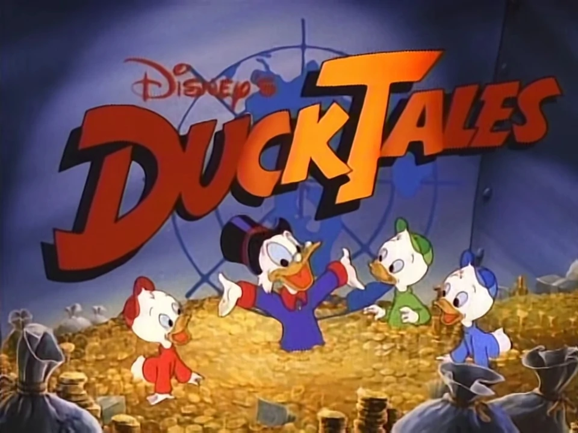

# ICG Projekt von Gruppe 5
<!-- Ein Bild der Anwendung muss im Ordner ./img relativ zu dieser Datei liegen -->

<!--  -->

Dieses Repository beinhaltet das Projekt des Kurses  "Interaktive Computergraphik" von Lorenz Bauer, Julius Arzberger, Marius Röhm 

# Projekt Struktur
<!-- Ihr könnt die Projektstruktur beliebig beschreiben. Hier einfach mit dem Unix Programm `tree`  -->

```
.
├── README.md
├── dist
│   ├── index.html
│   ├── src
│   └── textures <-- Texturen
├── ...
├── img <-- Dokumentation
│   └── screenshot.png
├── obj <-- OBJ Dateien
├── src
│   ├── abgabe.ts <-- Boilerplate 
│   ├── ...
│   ├── loader  <-- shader loader
│   ├── math <-- Mathe Bibliothek
│   ├── parser <-- OBJ Parser
│   ├── renderers 
│   ├── saveload.ts <-- Laden / Speichern
│   └── scene  <-- Szenengraph
│       ├── ...
│       ├── camera.ts
│       ├── ...
│       ├── interaction.ts
│       ├── sceneUtils.ts
│       └── visitors <--  Visitors
└── ...

```

Das Projekt ist in mehreren Ordner thematisch aufgeteilt. 
`dist` beinhaltet Ressourcen die im Browser direkt verwendet werden. In `obj` liegen Beispieldateien, welche durch unseren OBJ Loader in die Szene geladen werden können. 
Unter `src` sind alle Quelldateien zusammengefasst, welche durch `webgl` transpiliert werden.
Hierbei haben wir die Pakete entsprechend ihren Funktionen strukturiert:
- `scene`  umfasst die Datenstrukturen für Szene und deren Interaktion
- ...
- ...

# Installation

Wechseln Sie mit einer Konsole in das Verzeichnis dieser Datei und füren Sie 

```
npm install
```
aus.
### Ausführung
Geben Sie anschließend 
```bash
npm start
```
eingeben und rufen die Website des Servers über to `0.0.0.0:<port>` bzw. `localhost:<port>` im Browser aufrufen. Der Port ist hierbei aus der Ausgabe der Konsole zu ersetzen.


# How-To

Im folgenden wird erklärt wie die Anwendung zu bedienen ist:

## Free Flight Modus

Um zwischen Fester Kamera und Free Flight Modus zu wechseln ...

## Beleuchtungsparameter

Die Slider auf der rechten Seite des Bildes von oben  ... 

### Funktionen 

|Nummer|Punkte|Beschreibung |bearbeitet| Verantwortliche/r |
|------|------|---------------------------------------|---------------|-|
|M1 |5 |Szenengraph | <ul><li>- [ ] </li></ul> | |
|M2 |10 |Rasteriser & Ray Tracer | <ul><li>- [ ] </li></ul> | |
|M3 |3 |min. drei eingebundene Objekte | <ul><li>- [ ] </li></ul> | |
|M4 |8 |min. drei verschiedene Animationsknoten| <ul><li>- [ ] </li></ul> | |
|M5 |4 |Objekte mit Textur | <ul><li>- [ ] </li></ul> | |
|M6 |5 |mathematische Bibliothek |<ul><li>- [ ] </li></ul> | |
|M7 |4 |Phong Shader | <ul><li>- [ ] </li></ul> | |
|M8 |2 |Zwei Anwendungsfenster| <ul><li>- [ ] </li></ul> | |
|M9 |4 |Taskleiste mit Icons | <ul><li>- [ ] </li></ul> | |
|M10 |5 |Auswahl & Manipulation per Maus | <ul><li>- [ ] </li></ul> | |


### Kompatibilität
Das Projekt wurde mit folgenden Konfigurationen getestet:
<!-- Nur die Konfigurationen angeben die ihr wirklich getestet habt. Eine gängige Kombination ist hier schon ausreichend-->
- Windows 10 Build Version <> mit
  - Firefox Version <>
  - Chrome Version <> 
  - Edge Version - nein
  - Internet Explorer - nein 
  - node js Version <>
<!--
- Manjaro Build Version <> mit
  - Firefox Version <>
  - Chrome Version <> 
  - Opera Version <>
  - Chromium Version <>
  - node js Version <> 
- macOs Build Version <> mit
  - Firefox Version <>
  - Chrome Version <> 
  - Safari Version <>
  - Chromium Version <>
  - node js Version <>
-->
